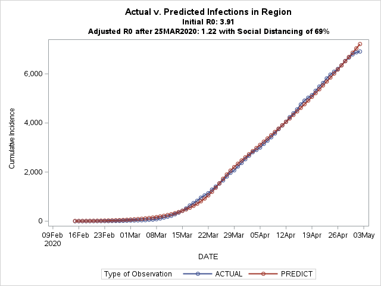
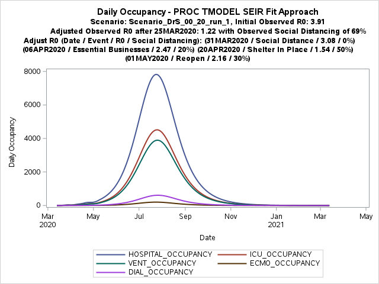

# covid
COVID-19 tool development

An open collaboration between the Cleveland Clinic and SAS Institute.

# What this Code Does
This code takes a set of input parameters and uses them in infectious disease models (SIR & SEIR).  Model output is used to calculate useful metrics for each day of an epidemic, such as the number of hospitalizations.  

# Documentation
In addition to the information shared within this readme and the commenting within the code, you can also review the [documentation on the implementation of the models](./docs/seir-modeling).

# Getting Started
- **PREPARE**
    - Download `COVID_19.sas` to your SAS environment
        - Also, download the `run_scenario.csv` file for an example submission file to run many scenarios in batch
- **SETUP**
    - Edit `line 10` to a local directory you want to save datasets with model output and scenario information to
    - If you do not have SAS/ETS then edit `line 16` to 'NO'
        - This option causes the SIR/SEIR models to run with a SAS Data Step version only
        - If you are unsure then you can run `PROC PRODUCT_STATUS; run;` in SAS and view the log for this information
    - If you have the latest analytical release of SAS, 15.1, then set `line 17` to YES
        - This option swaps out `PROC MODEL` for `PROC TMODEL`
        - If you are unsure then you can run `PROC PRODUCT_STATUS; run;` in SAS and view the log for this information
    - If you have SAS Viya and want to manage the `STORE.MODEL_FINAL` table in CAS, then set `line 18` to YES
        - with each scenario run the `STORE.MODEL_FINAL` table the CASUSER table `MODEL_FINAL` are appended to (or created on first fun)
- **RUN**
    - Make calls to the macro `%EasyRun`.  Example scenarios are at the end of the file.
    - Submit many scenarios in batch by using an input file.  An example file, `run_scenarios.csv`, is provided. Each row of this file will feed individual calls to the `%EasyRun` macro.
- **REVIEW**
    - All model output for each call to `%EasyRun` saves in the dataset `STORE.MODEL_FINAL`
    - All of the parameters that lead to the results in `STORE.MODEL_FINAL` save in `STORE.SCENARIOS`, and all inputs to the macro also save to `STORE.INPUTS`.  The variable `SCENARIOINDEX` links these files.
- **ADJUST inputs to your population**
    - Change the input parameters to match the population you are working with.  If their is a wide range of scenarios you want to run then use the run_scenarios.csv method to easily submit all the combinations.

# Input Definitions & Notes
**INPUT:**
- The description of the input parameters for the `%EasyRun` Macro follow the macro definition in `COVID_19.sas` and are detailed in the table below:

| Input Parameter | Description | Example Input | Type of Parameter |
| --- | --- | --- | --- |
| Scenario | Scenario Name to be stored as a character variable, combined with automatically-generated ScenarioIndex to create a unique ID | Scenario_DrS_00_20_run_1 (spaces are ok) | positional |
| IncubationPeriod | Number of days by which to offset hospitalization from infection, effectively shifting utilization curves to the right | 0 | positional |
| InitRecovered | Initial number of Recovered patients, assumed to have immunity to future infection | 0 | positional |
| RecoveryDays | Number of days a patient is considered infectious (the amount of time it takes to recover or die) | 14 | positional |
| doublingtime | Baseline Infection Doubling Time without social distancing | 5 | positional |
| Population | Number of people in region of interest, assumed to be well mixed and independent of other populations | 4690484 | positional |
| KnownAdmits | Number of COVID-19 patients at hospital of interest at Day 0, used to calculate the assumed number of Day 0 Infections | 10 | positional |
| SocialDistancing | Baseline Social distancing (% reduction in social contact compared to normal activity) | 0 | positional |
| ISOChangeDate | Date of first change from baseline in social distancing parameter | '13MAR2020'd | positional |
| SocialDistancingChange | Second value of social distancing (% reduction in social contact compared to normal activity) | 0 | positional |
| ISOChangeDateTwo | Date of second change in social distancing parameter | '06APR2020'd | positional |
| SocialDistancingChangeTwo | Third value of social distancing (% reduction in social contact compared to normal activity) | 0.4 | positional |
| ISOChangeDate3 | Date of third change in social distancing parameter | '20APR2020'd | positional |
| SocialDistancingChange3 | Forth value of social distancing (% reduction in social contact compared to normal activity) | 0.5 | positional |
| ISOChangeDateTwo | Date of fourth change in social distancing parameter | '01May2020'd | positional |
| SocialDistancingChangeTwo | Fifth value of social distancing (% reduction in social contact compared to normal activity) | 0.3 | positional |
| MarketSharePercent | Anticipated share (%) of hospitalized COVID-19 patients in region that will be admitted to hospital of interest | 0.29 | positional |
| Admission_Rate | Percentage of Infected patients in the region who will be hospitalized | 0.075 | positional |
| ICUPercent | Percentage of hospitalized patients who will require ICU | 0.45 | positional |
| VentPErcent | Percentage of hospitalized patients who will require Ventilators | 0.35 | positional |
| FatalityRate | Percentage of hospitalized patients who will die | 0 | positional |
| plots | YES/NO display plots in output | YES | keyword |
| N_DAYS | Number of days to project | 365 | keyword |
| DiagnosedRate | Factor to adjust admission_rate contributing to via MarketSharePercent I (see calculation for I) | 1.0 | keyword |
| E | Initial Number of Exposed (infected but not yet infectious) | 0 | keyword |
| SIGMA | Rate of latent individuals Exposed and transported to the infectious stage during each time period | 0.90 | keyword |
| DAY_ZERO | Date of the first COVID-19 case | '13MAR2020'd | keyword |
| BETA_DECAY | Factor (%) used for daily reduction of Beta | 0.0 | keyword |
| ECMO_RATE | Default percent of total admissions that need ECMO | 0.03 | keyword |
| DIAL_RATE | Default percent of admissions that need Dialysis | 0.05 | keyword |
| HOSP_LOS | Average Hospital Length of Stay | 7 | keyword |
| ICU_LOS | Average ICU Length of Stay | 9 | keyword |
| VENT_LOS | Average Vent Length of Stay | 10 | keyword |
| ECMO_LOS | Average ECMO Length of Stay | 6 | keyword |
| DIAL_LOS | Average DIAL Length of Stay | 11 | keyword |

# Output Files Notes
**OUTPUT:**
- `STORE.MODEL_FINAL`: The model output saves to in `STORE.MODEL_FINAL` which has descriptive labels for each column.
- `STORE.SCENARIOS`: The scenario parameters (input and calculated) are stored in `STORE.SCENARIOS` which has labels for each column and links to `STORE.MODEL_FINAL` on the column `ScenarioIndex`.
- `STORE.INPUTS`: The inputs to the `%EasyRun` macro are stored in `STORE.INPUTS` for easy review and inclusion in reporting by linking to `STORE.MODEL_FINAL` on the column `ScenarioIndex`.
- `STORE.FIT_INPUT`: The ModelType="TMODEL - SEIR - FIT" stores input data in `STORE.FIT_INPUT`. Links to other files on the columns `ModelType` and `ScenarioIndex`.
- `STORE.FIT_PRED`: The ModelType="TMODEL - SEIR - FIT" stores prediction from the fit in `STORE.FIT_PRED` Links to other files on the columns `ModelType` and `ScenarioIndex`.
- `STORE.FIT_PARMS`: The ModelType="TMODEL - SEIR - FIT" stores parameter estimates from the fit in `STORE.FIT_PARMS` Links to other files on the columns `ModelType` and `ScenarioIndex`.

**IMPORTANT NOTE:** 
- `STORE.MODEL_FINAL` stores each scenario and each model type with 1 row per day. Make sure you are viewing the results for a single scenario and single model type by filtering on the variables `ScenarioNameUnique` and `ModelType`

# Notes on Model Types
This code computes SIR and SEIR models with different methods and different parameterizations, as described in the following. 

The output file, MODEL_FINAL, uses the column ModelType to differentiate output from each of the following setups:
- **ModelType = 'DS - SIR'**
    - Fits a SIR model with Data Step
    - Initial values of `&SocialDistancing` contribute to `BETA` and then `&ISOChangeDate` used to step Beta down using `&SocialDistancingChange` at the specified date.  Similarly, `&ISOChangeDateTwo` and `&SocialDistancingChangeTwo` are and additional step down.
    - An internal parameter, `&BETA_DECAY`, is used to adjust `BETA` each day.  It is currently set to 0.
- **ModelType = 'DS - SEIR'**
    - Fits an SEIR model with Data Step
    - Initial values of `&SocialDistancing` contribute to `BETA` and then `&ISOChangeDate` used to step Beta down using `&SocialDistancingChange` at the specified date.  Similarly, `&ISOChangeDateTwo` and `&SocialDistancingChangeTwo` are and additional step down.
    - An internal parameter, `&BETA_DECAY`, is used to adjust `BETA` each day.  It is currently set to 0.
- **ModelType = 'TMODEL - SEIR'**
    - Fits an SEIR model with PROC (T)MODEL 
    - The `BETA` parameter incorporates different `R0` parameters for each phase as defined by: before `&ISOChangeDate`, starting on `&ISOChangeDateTwo`, the period between these two
- **ModelType = 'TMODEL - SIR'**
    - Fits an SEIR model with PROC (T)MODEL 
    - The `BETA` parameter incorporates different `R0` parameters for each phase as defined by: before `&ISOChangeDate`, starting on `&ISOChangeDateTwo`, the period between these two
- **ModelType = 'TMODEL - SEIR - FIT'**
    - This is a prototype for using a data feed of daily case counts from a geographical region.  In this prototype case it is a region of the state of Ohio in the United States.
        - The feed is stored in `STORE.FIT_INPUT`.  You could replace the data in the file with data from your region of analysis.
    - Fits a SEIR model with PROC (T)MODEL 
    - Uses input data to fit cumulative cases by day and stores the predictions in `STORE.FIT_PRED` as well as the parameter estimates in `STORE.FIT_PARMS`
    - The fitted model is used to solve the specification of the SEIR model.

# Notes
- The current locked version of the project is in `COVID_19.sas`.
- Progress towards the next locked version is in the `/progress` folder
- the `COVID_19.sas` file is built from modular parts in `/build/parts` into the `/build/public` folder by `/build/build.py` and then copied here

# Example Visuals
With the option `plots=yes`, the `COVID_19.sas` program will create diagnositic visuals for each scenario. Some example of these visuals follow.  The output data is also available in SAS Visual Analytics with user interface to drive the running of scenarios is in the works.
| All Approaches | Fitting Approaches |
:-------------------------:|:-------------------------:
  |  
  |  