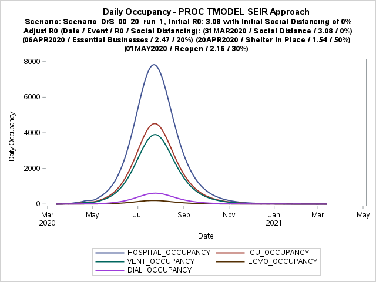
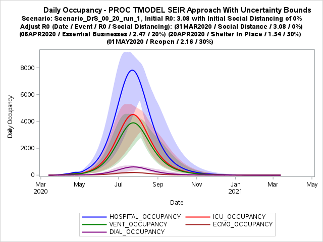
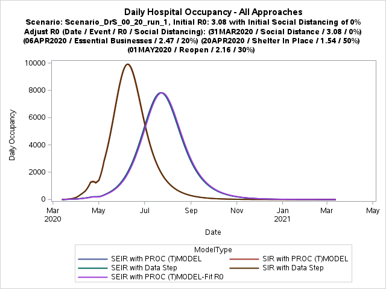
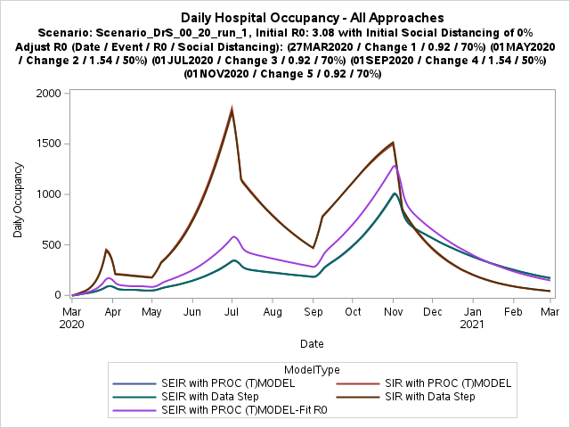

# covid-19-sas

This is a collaboration space for SAS and others to understand, model, and mitigate COVID-19 through analytics. The projects here include:

* [SIR & SEIR Modeling (with Cleveland Clinic)](#sir--seir-modeling-with-cleveland-clinic)
* [Data sources for COVID-19 reporting](#data-sources-for-covid-19-reporting)

To use the work in these projects, a SAS environment is required.  Refer to the documentation for each project to learn more about the SAS system requirements.

## SIR & SEIR Modeling (with Cleveland Clinic)

This first entry is a collaboration between the Cleveland Clinic and SAS Institute. Explore [the /CCF folder](./CCF)
for code and documentation about the model implementation.

### Outputs from sample scenarios

Among other outputs, these analyses will create diagnostic visuals for each modeled scenario.

| All Approaches | Fitting Approaches |
:-------------------------:|:-------------------------:
  |  
  |  
  |  

## Data sources for COVID-19 reporting

SAS developers and data scientists maintain a [Coronavirus Dashboard Report](https://www.sas.com/covid19) using SAS Visual Analytics.
The dashboard is refreshed daily with new data from several public data sources.  [In the /Data folder](./Data), the team has shared
the SAS programs that are used to retrieve and prepare this data for reporting.
